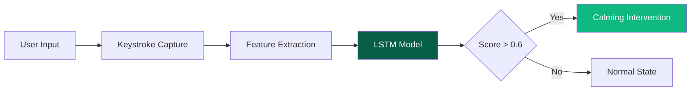

<p align="center">
  
</p>

<h1 align="center">
  
  <br/>
  TypeState
</h1>

<p align="center">
  <em>Quantifying Cognitive Load through Keystroke Dynamics</em>
</p>

<p align="center">
  <a href="https://1mystic.github.io/TypeState/">
    
  </a>
  <a href="Overview-Report.pdf">
    
  </a>
</p>

<p align="center">
  
  
  
  
</p>

---

## Abstract

TypeState is a research project investigating the **correlation between keystroke dynamics and cognitive load**. By capturing and analyzing typing patterns in real-time, we demonstrate that adaptive user interfaces can detect and respond to user stress states before they escalate.

This repository contains the complete research pipeline: data collection interface, feature engineering scripts, trained LSTM model, and real-time inference server.

> **[Download Full Research Report (PDF)](Overview-Report.pdf)**

---

## Research Overview

| Metric | Value | Description |
|:-------|:-----:|:------------|
| Stress Threshold | **0.6** | Classification boundary for high cognitive load |
| Temporal Resolution | **15ms** | Keystroke timing precision |
| Sequence Window | **20** | Keystrokes analyzed per inference |
| Privacy Model | **Local** | No personally identifiable information stored |

### Project Milestones

| Phase | Status | Description |
|:------|:------:|:------------|
| Data Collection | Complete | Web-based keystroke capture with dual-mode sessions |
| Feature Engineering | Complete | Flight time, dwell time, rolling variance extraction |
| Model Training | Complete | LSTM neural network for real-time classification |
| Web Integration | Complete | Live stress detection with calming UI intervention |
| Documentation | Complete | [Research report available](Overview-Report.pdf) |

---

## Methodology

### System Architecture



### Feature Set

| Feature | Definition | Rationale |
|:--------|:-----------|:----------|
| Flight Time | Time between consecutive key presses (ms) | Hesitation indicates cognitive load |
| Flight Time Variance | Rolling variance (window=5) | Rhythm inconsistency correlates with stress |
| Error Rate | Backspace frequency | Frustration manifests as correction attempts |

---

## Installation

### Prerequisites

- Python 3.9+
- TensorFlow 2.x
- FastAPI

### Setup

```bash
git clone https://github.com/1mystic/TypeState.git
cd TypeState

# Create virtual environment
python -m venv .venv

# Activate
# Windows:
.venv\Scripts\activate
# macOS/Linux:
source .venv/bin/activate

# Install dependencies
pip install fastapi uvicorn tensorflow pandas numpy joblib scikit-learn
```

### Running the System

**1. Start the AI Server**

```bash
cd typestate_ml
uvicorn server:app --reload
```

Server available at `http://127.0.0.1:8000`

**2. Launch the Interface**

Open `site/index.html` in browser, or use VS Code Live Server.

---

## Repository Structure

```
TypeState/
├── site/                       # Frontend Web Application
│   ├── index.html              # Landing page
│   ├── collector.html          # Data collection interface
│   ├── about.html              # Project information
│   ├── research.html           # Related literature
│   └── assets/
│       ├── css/style.css       # Styling
│       └── js/collector.js     # Keystroke capture
│
├── typestate_ml/               # AI Backend
│   ├── server.py               # FastAPI inference server
│   ├── typestate_model.h5      # Trained LSTM model
│   └── typestate_scaler.pkl    # Feature normalizer
│
├── data_analysis/              # Research Pipeline
│   ├── feature_extraction.py   # Raw data processing
│   ├── process_data.py         # Dataset preparation
│   ├── visualise.py            # Visualization scripts
│   └── stress_signature.png    # Sample output
│
├── Overview-Report.pdf         # Full Research Report
└── README.md
```

---

## Research Process

### Phase 1: Data Collection

Participants completed typing tasks under two conditions:
- **Relaxed Mode** — Standard typing environment
- **Stressed Mode** — Time pressure with error-induced frustration

```javascript
// Captured event structure
{
  "key": "KeyA",
  "type": "down",
  "time": 1702534892123,
  "char": "a"
}
```

### Phase 2: Feature Engineering

```python
# Core feature extraction
df['flight_time'] = df.groupby('session_id')['timestamp'].diff()
df['flight_time_var'] = df['flight_time'].rolling(window=5).var()
df['is_error'] = (df['key'] == 'Backspace').astype(int)
```

### Phase 3: Model Architecture

```
Input: Sequence of 20 keystroke features
    ↓
LSTM Layer (64 units, return_sequences=True)
    ↓
LSTM Layer (32 units)
    ↓
Dense Layer (16 units, ReLU)
    ↓
Output (1 unit, Sigmoid) → Stress Score [0.0 - 1.0]
```

### Phase 4: Intervention Design

When stress score exceeds **0.6**, the system:
- Transitions background to calming sage green
- Displays "High Cognitive Load Detected" notification
- Softens UI elements to reduce visual stress

---

## Design System

| Token | Value | Application |
|:------|:------|:------------|
| `--primary` | `#3D6A4B` | Primary actions |
| `--surface` | `#F2F6F3` | Background |
| `--highlight` | `#1A4228` | Emphasis text |
| `--accent` | `#065f46` | Interactive elements |

---

## Related Literature

- **Lim et al. (2014)** — Statistical correlation between keystroke latency and cognitive load using static classifiers
- **Nie et al. (2022)** — Random forest approach for stress detection in academic writing sessions

---

## Documentation

For complete methodology, experimental design, results, and analysis:

**[Download Research Report (PDF)](Overview-Report.pdf)**

---

## License


This is an **original work** by **Atharv Khare**. All use, reproduction, or distribution must include proper attribution to the original author.

Released under the **MIT License** :  see [LICENSE](LICENSE) for details.

**© 2025-2026 Atharv Khare. All Rights Reserved.**

---

<p align="center">
  <a href="https://1mystic.github.io/TypeState/"><strong>Live Demo</strong></a>
  &nbsp;|&nbsp;
  <a href="Overview-Report.pdf"><strong>Research Report</strong></a>
</p>
